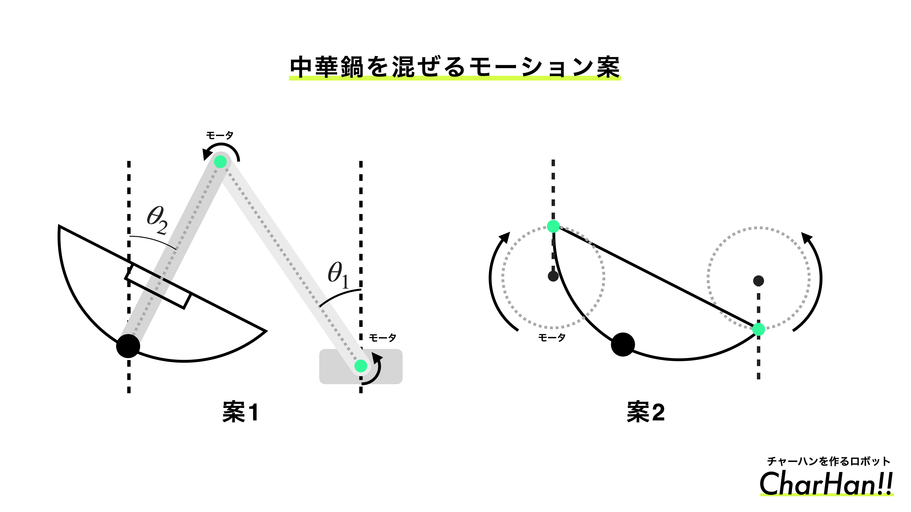

# 🍚CharHan!!

チャーハンの調理を自動化するCharHan!!というロボットを作りました。

[CharHan!!-YouTube](https://www.youtube.com/watch?v=2m1POazWTIs)

## 🔥CharHan!!機械概要

案2を採用しました。

左右にモータを取り付けて左右の回転の同期する制御を入れています。

左右のリンクにエンコーダを搭載しており、角度と速度を左右で同期しています。

制御器は3種類設計し、評価しました。

## 🤖炒め作業の自動化

このようなチャーハンファームを作ることで省人化できるのではないかと思っております。

## 📁ファイルに関して

- Program
  - ロボットを動かすソフトウェアが入っています。PlatformIOで開発を行いました。
  - SystemIdentificationDataにMATLABでシステム同定を行ったプログラムが入っています。
    - 以下がシステム同定を行うために使用した組み込み側のデータロギングのプログラムです。シリアルモニターで受け取った文字列を元にCSVで書き出して整形してシステム同定を行いました。
    - `Program/main_tomix/src/Modes/SystemIdentification2`
    - `Program/main_tomix/src/Modes/SystemIdentification2`
- PCB
  - 基板データが入っています。KiCad7で開発しました。
- Image
  - README.mdの画像が入っています。